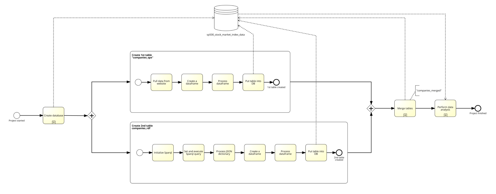

# S&P 500 Stock Market Index - Companies
**Author:** Nikita Pikulenko

**Intended Goal**: To construct two distinct tables featuring data on S&P 500 companies, and then merge them into a single final table. Store all tables in a newly created database. Finally perform data analysis and create data visualizations. Look at which sectors are leading in terms of average market capitalization and company count. 

**Database Structure**:
* Database Name: sp500_stock_market_index_data
* Tables:
    * companies_spx: Data pulled from website
        * columns: symbol, company_name, sector, market_cap
    * companies_rdf: Data acquired via SPARQL query from DBpedia.
        * columns: symbol, company_name, revenue, net_income, assets, equity, num_of_employees
    * companies_merged: The final table merged with a pandas function taking in an SQL query as input.

**Final Table Specifications**:

* Table Name: companies_merged
* Columns:
    - ticker: The unique stock ticker symbol for each company
    - company_name
    - sector
    - market_cap: the market capitalization of the company
    - revenue
    - net_income
    - assets
    - equity
    - num_of_employees


Navigation Links: <br>
[Database Initialization](#database_init) <br>
[1st Table - Data from Website](#1st_table) <br>
[2nd Table - RDF Part](#rdf_part) <br>
[Merging Tables](#table_merge) <br>
[Data Analysis with Visualization](#data_analysis)

Project Flow:



<a id="database_init"></a>
# Database Initialization
* Creating a Database called "sp500_stock_market_index_data"
* Activating SQL jupyter extension
* Establishing connection to the database


```python
%reload_ext sql
```


```python
%sql sqlite:///sp500_stock_market_index_data.db
```


```python
from sqlalchemy import create_engine

# Establishing connection to our database
conn = create_engine('sqlite:///sp500_stock_market_index_data.db')
```

<a id="1st_table"></a>
# 1st Table: Pulling Data from a Website
Plan: <br>
1) Import packages
2) Get Initial S&P 500 Data on Companies from the following website: https://www.liberatedstocktrader.com/sp-500-companies
3) Save Table in the DB as "companies_spx"


```python
import pandas as pd
import numpy as np
```


```python
tables = pd.read_html('https://www.liberatedstocktrader.com/sp-500-companies', header=0)
```


```python
# pd.read_html() grabs all tables that it sees from a website
# we just take the first table

df_spx = tables[0]
```


```python
# quick look
df_spx.head()
```


<div>
<style scoped>
    .dataframe tbody tr th:only-of-type {
        vertical-align: middle;
    }

    .dataframe tbody tr th {
        vertical-align: top;
    }

    .dataframe thead th {
        text-align: right;
    }
</style>
<table border="1" class="dataframe">
  <thead>
    <tr style="text-align: right;">
      <th></th>
      <th>Ticker</th>
      <th>Description</th>
      <th>Sector</th>
      <th>Market Capitalization</th>
    </tr>
  </thead>
  <tbody>
    <tr>
      <th>0</th>
      <td>AAPL</td>
      <td>Apple Inc.</td>
      <td>Electronic Technology</td>
      <td>2728017215293</td>
    </tr>
    <tr>
      <th>1</th>
      <td>MSFT</td>
      <td>Microsoft Corporation</td>
      <td>Technology Services</td>
      <td>2351371643107</td>
    </tr>
    <tr>
      <th>2</th>
      <td>GOOG</td>
      <td>Alphabet Inc.</td>
      <td>Technology Services</td>
      <td>1611856497958</td>
    </tr>
    <tr>
      <th>3</th>
      <td>GOOGL</td>
      <td>Alphabet Inc.</td>
      <td>Technology Services</td>
      <td>1610343852181</td>
    </tr>
    <tr>
      <th>4</th>
      <td>AMZN</td>
      <td>Amazon.com, Inc.</td>
      <td>Retail Trade</td>
      <td>1366884251763</td>
    </tr>
  </tbody>
</table>
</div>


### Quick Consistency Check
Checking if data types are consistent and there are no missing values and duplicates


```python
df_spx.info()
```

    <class 'pandas.core.frame.DataFrame'>
    RangeIndex: 503 entries, 0 to 502
    Data columns (total 4 columns):
     #   Column                 Non-Null Count  Dtype 
    ---  ------                 --------------  ----- 
     0   Ticker                 503 non-null    object
     1   Description            503 non-null    object
     2   Sector                 503 non-null    object
     3   Market Capitalization  503 non-null    int64 
    dtypes: int64(1), object(3)
    memory usage: 15.8+ KB


<font color='green' size=5>Desired Data Types ✅ </font>


```python
df_spx.isna().sum()
```


    Ticker                   0
    Description              0
    Sector                   0
    Market Capitalization    0
    dtype: int64


<font color='green' size=5>No Missing Values ✅ </font>


```python
df_spx.duplicated().sum()
```


    0


<font color='green' size=5>No Duplicates ✅ </font>

### Renaming Columns 
-> to make it less cumbersome to work with


```python
print("Before:", [*df_spx.columns])
```

    Before: ['Ticker', 'Description', 'Sector', 'Market Capitalization']


```python
df_spx.columns = ['symbol', 'company_name', 'sector', 'market_cap']
print("After:", [*df_spx.columns])
```

    After: ['symbol', 'company_name', 'sector', 'market_cap']


   

### Converting absolute numbers to billions

Before:


```python
df_spx['market_cap'].head(3)
```


    0    2728017215293
    1    2351371643107
    2    1611856497958
    Name: market_cap, dtype: int64


```python
df_spx['market_cap'] = round(df_spx['market_cap'] / 1000000000, 4)
```

After:


```python
df_spx['market_cap'].head(3)
```


    0    2728.0172
    1    2351.3716
    2    1611.8565
    Name: market_cap, dtype: float64


## Save Table into the Database as "companies_spx"


```python
%sql DROP TABLE IF EXISTS companies_spx
```

     * sqlite:///sp500_stock_market_index_data.db
    Done.


    []


```python
# Saving dataframe as table to our database
df_spx.to_sql('companies_spx', conn, index=False)
```


    503


## Table 1 Result


```python
%sql SELECT * FROM companies_spx LIMIT 15;
```

     * sqlite:///sp500_stock_market_index_data.db
    Done.


<table>
    <thead>
        <tr>
            <th>symbol</th>
            <th>company_name</th>
            <th>sector</th>
            <th>market_cap</th>
        </tr>
    </thead>
    <tbody>
        <tr>
            <td>AAPL</td>
            <td>Apple Inc.</td>
            <td>Electronic Technology</td>
            <td>2728.0172</td>
        </tr>
        <tr>
            <td>MSFT</td>
            <td>Microsoft Corporation</td>
            <td>Technology Services</td>
            <td>2351.3716</td>
        </tr>
        <tr>
            <td>GOOG</td>
            <td>Alphabet Inc.</td>
            <td>Technology Services</td>
            <td>1611.8565</td>
        </tr>
        <tr>
            <td>GOOGL</td>
            <td>Alphabet Inc.</td>
            <td>Technology Services</td>
            <td>1610.3439</td>
        </tr>
        <tr>
            <td>AMZN</td>
            <td>Amazon.com, Inc.</td>
            <td>Retail Trade</td>
            <td>1366.8843</td>
        </tr>
        <tr>
            <td>NVDA</td>
            <td>NVIDIA Corporation</td>
            <td>Electronic Technology</td>
            <td>1069.4853</td>
        </tr>
        <tr>
            <td>BRK.B</td>
            <td>Berkshire Hathaway Inc. New</td>
            <td>Finance</td>
            <td>768.8919</td>
        </tr>
        <tr>
            <td>META</td>
            <td>Meta Platforms, Inc.</td>
            <td>Technology Services</td>
            <td>728.9672</td>
        </tr>
        <tr>
            <td>TSLA</td>
            <td>Tesla, Inc.</td>
            <td>Consumer Durables</td>
            <td>683.9641</td>
        </tr>
        <tr>
            <td>LLY</td>
            <td>Eli Lilly and Company</td>
            <td>Health Technology</td>
            <td>518.7233</td>
        </tr>
        <tr>
            <td>V</td>
            <td>Visa Inc.</td>
            <td>Commercial Services</td>
            <td>485.5255</td>
        </tr>
        <tr>
            <td>UNH</td>
            <td>UnitedHealth Group Incorporated</td>
            <td>Health Services</td>
            <td>461.7075</td>
        </tr>
        <tr>
            <td>JNJ</td>
            <td>Johnson &amp; Johnson</td>
            <td>Health Technology</td>
            <td>448.2962</td>
        </tr>
        <tr>
            <td>XOM</td>
            <td>Exxon Mobil Corporation</td>
            <td>Energy Minerals</td>
            <td>440.5113</td>
        </tr>
        <tr>
            <td>JPM</td>
            <td>JP Morgan Chase &amp; Co.</td>
            <td>Finance</td>
            <td>432.9195</td>
        </tr>
    </tbody>
</table>


<a id="rdf_part"></a>
# Next Step: 2nd Table (RDF)

**Additional Data Of Interest**: revenue, netIncome, operatingIncome, assets, equity, numOfEmployees 

### Initializing the Sparql Environment and Constructing the Query


```python
from SPARQLWrapper import SPARQLWrapper, JSON
```


```python
sparql = SPARQLWrapper('https://dbpedia.org/sparql')
```

Most of the S&P 500 Companies have following important identifying properties in common: <br>
* dbo:type Public_company
* rdfs:type dbo:Company
* dbp:symbol - the ?symbol they are traded as on the stock market 
* dbo:wikiPageWikiLink - which includes the S&P 500 stock ?exchange as dbr:S&P_500 property 
* rdfs:label - ?company_name

Once successfully identified, additional data can be pulled:
* ?revenue - dbo:revenue
* ?netIncome - dbo:netIncome
* ?assets - dbo:assets
* ?equity - dbo:equity
* ?num_of_employees: dbo:numberOfEmployees

**3 challenges, SOLVED**: 
1) Issue accessing the dbr:S&P_500 property to identify company being part of S&P 500 (because of "&" sign) which is part of dbo:wikiPageWikiLink. We need a workaround.<br><br> **Solution**: check with a regular expression whether dbo:wikiPageWikiLink at any point contains a string 'S&P 500'  -->  (  FILTER(regex(str(?exchange), "S&P_500")) )

2) For some companies, some of the searched properties are not present at all. In this case, we don't want to get rid of corresponding companies completely and mark the values as missing instead, thus making it optinal for some properties to exist. <br><br> **Solution**: use COALESCE function to check if the property exists. If it does keep it, if not write 'nan'. --> f.e COALESCE(?revenue, "nan")) as ?revenue   +   OPTIONAL {?company dbo:revenue ?revenue} .

3) Some properties have a list of multiple values instead of a single value. We just want the first value. <br><br> **Solution**: using SAMPLE function which takes the first value of everything (we use it on top of the output of our COALESCE function, --> f.e  SAMPLE(COALESCE(?revenue, "nan")) as ?revenue, 

Finalized query:


```python
sparql.setQuery("""
PREFIX dbpedia2: <http://dbpedia.org/property/> 
PREFIX dbo: <http://dbpedia.org/ontology/>
PREFIX rdfs: <http://www.w3.org/2000/01/rdf-schema#>
PREFIX dbr: <http://dbpedia.org/resource/>
PREFIX dbp: <http://dbpedia.org/property/>

SELECT DISTINCT ?symbol, ?company_name, 
    SAMPLE(COALESCE(?revenue, "nan")) as ?revenue, 
    SAMPLE(COALESCE(?net_income, "nan")) as ?net_income,
    SAMPLE(COALESCE(?assets, "nan")) as ?assets, 
    SAMPLE(COALESCE(?equity, "nan")) as ?equity, 
    SAMPLE(COALESCE(?num_of_employees, "nan")) as ?num_of_employees
WHERE {
   ?company dbo:type dbr:Public_company .
   ?company a dbo:Company .
   ?company dbp:symbol ?symbol .
   ?company rdfs:label ?company_name .
   ?company dbo:wikiPageWikiLink ?exchange .

   OPTIONAL {?company dbo:revenue ?revenue} .
   OPTIONAL {?company dbo:netIncome ?net_income} .
   OPTIONAL {?company dbo:assets ?assets} .
   OPTIONAL {?company dbo:equity ?equity} .
   OPTIONAL {?company dbo:numberOfEmployees ?num_of_employees} .
   
   FILTER(regex(str(?exchange), "S&P_500"))
   FILTER(lang(?symbol) = 'en') 
   FILTER(lang(?company_name) = 'en') 
} LIMIT 1000
""") 
```


```python
sparql.setReturnFormat(JSON)
```

Executing the query:


```python
json_rdf = sparql.query().convert()
```

Taking a look on the output:


```python
json_rdf['results']['bindings'][:1]
```


    [{'symbol': {'type': 'literal', 'xml:lang': 'en', 'value': 'CTLT'},
      'company_name': {'type': 'literal', 'xml:lang': 'en', 'value': 'Catalent'},
      'revenue': {'type': 'typed-literal',
       'datatype': 'http://dbpedia.org/datatype/usDollar',
       'value': '3.998E9'},
      'net_income': {'type': 'typed-literal',
       'datatype': 'http://dbpedia.org/datatype/usDollar',
       'value': '5.85E8'},
      'assets': {'type': 'typed-literal',
       'datatype': 'http://dbpedia.org/datatype/usDollar',
       'value': '9.112E9'},
      'equity': {'type': 'typed-literal',
       'datatype': 'http://dbpedia.org/datatype/usDollar',
       'value': '3.915E9'},
      'num_of_employees': {'type': 'typed-literal',
       'datatype': 'http://www.w3.org/2001/XMLSchema#nonNegativeInteger',
       'value': '14000'}}]


```python
len(json_rdf['results']['bindings'])
```


    443


There are 503 Companies officially registered in the S&P 500. Having 443 of those through a Sparql query is a good ratio (~90%).

#### I want to clean the outputted json dictionary to simplify and prettify it.


```python
# For each key, we only need the value of the nested key named 'value'
# we can use a dictionary comprehension

json_rdf_cleaned = []

for row in json_rdf['results']['bindings']:
    temp_dict = {}
    for key in row.keys():
        temp_dict[key] = row[key]['value']
    json_rdf_cleaned.append(temp_dict)
```


```python
json_rdf_cleaned[:3]
```


    [{'symbol': 'CTLT',
      'company_name': 'Catalent',
      'revenue': '3.998E9',
      'net_income': '5.85E8',
      'assets': '9.112E9',
      'equity': '3.915E9',
      'num_of_employees': '14000'},
     {'symbol': 'BLK',
      'company_name': 'BlackRock',
      'revenue': '1.917E10',
      'net_income': '5.9E9',
      'assets': '1.5265E11',
      'equity': '3.769E10',
      'num_of_employees': '18400'},
     {'symbol': 'DVN',
      'company_name': 'Devon Energy',
      'revenue': '1.2206E10',
      'net_income': '2.808E9',
      'assets': '2.1025E10',
      'equity': '9.399E9',
      'num_of_employees': '1600'}]


## Creating a DataFrame out of the JSON Dictionary


```python
df_rdf = pd.json_normalize(json_rdf_cleaned)
```

Table view:


```python
df_rdf.head()
```


<div>
<style scoped>
    .dataframe tbody tr th:only-of-type {
        vertical-align: middle;
    }

    .dataframe tbody tr th {
        vertical-align: top;
    }

    .dataframe thead th {
        text-align: right;
    }
</style>
<table border="1" class="dataframe">
  <thead>
    <tr style="text-align: right;">
      <th></th>
      <th>symbol</th>
      <th>company_name</th>
      <th>revenue</th>
      <th>net_income</th>
      <th>assets</th>
      <th>equity</th>
      <th>num_of_employees</th>
    </tr>
  </thead>
  <tbody>
    <tr>
      <th>0</th>
      <td>CTLT</td>
      <td>Catalent</td>
      <td>3.998E9</td>
      <td>5.85E8</td>
      <td>9.112E9</td>
      <td>3.915E9</td>
      <td>14000</td>
    </tr>
    <tr>
      <th>1</th>
      <td>BLK</td>
      <td>BlackRock</td>
      <td>1.917E10</td>
      <td>5.9E9</td>
      <td>1.5265E11</td>
      <td>3.769E10</td>
      <td>18400</td>
    </tr>
    <tr>
      <th>2</th>
      <td>DVN</td>
      <td>Devon Energy</td>
      <td>1.2206E10</td>
      <td>2.808E9</td>
      <td>2.1025E10</td>
      <td>9.399E9</td>
      <td>1600</td>
    </tr>
    <tr>
      <th>3</th>
      <td>RSG</td>
      <td>Republic Services</td>
      <td>1.0153E10</td>
      <td>9.69E8</td>
      <td>2.3434E10</td>
      <td>8.488E9</td>
      <td>35000</td>
    </tr>
    <tr>
      <th>4</th>
      <td>ROK</td>
      <td>Rockwell Automation</td>
      <td>7.76E9</td>
      <td>9.19E8</td>
      <td>1.076E10</td>
      <td>3.02E9</td>
      <td>nan</td>
    </tr>
  </tbody>
</table>
</div>


### Checking Missing Values


```python
df_rdf.isna().value_counts()

for col in df_rdf.columns:
    try: 
        print(f"{col}: {df_rdf[col].astype('float').isna().value_counts().values[1]} missing values")
    except:
        continue
```

    revenue: 35 missing values
    net_income: 69 missing values
    assets: 75 missing values
    equity: 86 missing values
    num_of_employees: 31 missing values


### Quick Data Processing

Converting the scientific numbers to absolute numbers --> Replacing missing values with 0 (for further division) --> converting to billions (except number of employees) --> rounding to 4 decimals --> replacing 0 with np.nan again


```python
df_rdf['revenue'] = round(df_rdf['revenue'].astype('float').fillna(0) / 1000000000, 4).replace(0, np.nan)
df_rdf['net_income'] = round(df_rdf['net_income'].astype('float').fillna(0) / 1000000000, 4).replace(0, np.nan)
df_rdf['assets'] = round(df_rdf['assets'].astype('float').fillna(0) / 1000000000, 4).replace(0, np.nan)
df_rdf['equity'] = round(df_rdf['equity'].astype('float').fillna(0) / 1000000000, 4).replace(0, np.nan)
df_rdf['num_of_employees'] = df_rdf['num_of_employees'].astype('float').fillna(0).astype('int').replace(0, np.nan)
```

#### Let's test and find Apple for example:


```python
df_rdf[df_rdf.symbol == 'AAPL']
```


<div>
<style scoped>
    .dataframe tbody tr th:only-of-type {
        vertical-align: middle;
    }

    .dataframe tbody tr th {
        vertical-align: top;
    }

    .dataframe thead th {
        text-align: right;
    }
</style>
<table border="1" class="dataframe">
  <thead>
    <tr style="text-align: right;">
      <th></th>
      <th>symbol</th>
      <th>company_name</th>
      <th>revenue</th>
      <th>net_income</th>
      <th>assets</th>
      <th>equity</th>
      <th>num_of_employees</th>
    </tr>
  </thead>
  <tbody>
    <tr>
      <th>167</th>
      <td>AAPL</td>
      <td>Apple Inc.</td>
      <td>394.33</td>
      <td>99.8</td>
      <td>352.76</td>
      <td>50.67</td>
      <td>164000.0</td>
    </tr>
  </tbody>
</table>
</div>


## Table 2 Result

#### Numbers in Bio. USD. (except num_of_employees)


```python
df_rdf.sort_values(by='revenue', ascending=False).head(10)
```


<div>
<style scoped>
    .dataframe tbody tr th:only-of-type {
        vertical-align: middle;
    }

    .dataframe tbody tr th {
        vertical-align: top;
    }

    .dataframe thead th {
        text-align: right;
    }
</style>
<table border="1" class="dataframe">
  <thead>
    <tr style="text-align: right;">
      <th></th>
      <th>symbol</th>
      <th>company_name</th>
      <th>revenue</th>
      <th>net_income</th>
      <th>assets</th>
      <th>equity</th>
      <th>num_of_employees</th>
    </tr>
  </thead>
  <tbody>
    <tr>
      <th>230</th>
      <td>WMT</td>
      <td>Walmart</td>
      <td>572.800</td>
      <td>13.670</td>
      <td>244.860</td>
      <td>91.891</td>
      <td>2300000.0</td>
    </tr>
    <tr>
      <th>97</th>
      <td>AMZN</td>
      <td>Amazon (company)</td>
      <td>469.822</td>
      <td>33.364</td>
      <td>420.549</td>
      <td>138.245</td>
      <td>NaN</td>
    </tr>
    <tr>
      <th>167</th>
      <td>AAPL</td>
      <td>Apple Inc.</td>
      <td>394.330</td>
      <td>99.800</td>
      <td>352.760</td>
      <td>50.670</td>
      <td>164000.0</td>
    </tr>
    <tr>
      <th>226</th>
      <td>CVS</td>
      <td>CVS Health</td>
      <td>292.110</td>
      <td>7.910</td>
      <td>232.990</td>
      <td>75.380</td>
      <td>300000.0</td>
    </tr>
    <tr>
      <th>405</th>
      <td>UNH</td>
      <td>UnitedHealth Group</td>
      <td>285.273</td>
      <td>17.285</td>
      <td>212.206</td>
      <td>75.045</td>
      <td>380000.0</td>
    </tr>
    <tr>
      <th>181</th>
      <td>XOM</td>
      <td>ExxonMobil</td>
      <td>276.692</td>
      <td>23.040</td>
      <td>338.923</td>
      <td>168.577</td>
      <td>64000.0</td>
    </tr>
    <tr>
      <th>83</th>
      <td>BRK.A</td>
      <td>Berkshire Hathaway</td>
      <td>276.100</td>
      <td>89.800</td>
      <td>958.800</td>
      <td>514.900</td>
      <td>372000.0</td>
    </tr>
    <tr>
      <th>288</th>
      <td>BRK.B</td>
      <td>Berkshire Hathaway</td>
      <td>276.100</td>
      <td>89.800</td>
      <td>958.800</td>
      <td>514.900</td>
      <td>372000.0</td>
    </tr>
    <tr>
      <th>248</th>
      <td>MCK</td>
      <td>McKesson Corporation</td>
      <td>263.970</td>
      <td>1.290</td>
      <td>63.300</td>
      <td>1.790</td>
      <td>2022.0</td>
    </tr>
    <tr>
      <th>130</th>
      <td>GOOG</td>
      <td>Alphabet Inc.</td>
      <td>257.600</td>
      <td>76.000</td>
      <td>359.300</td>
      <td>251.600</td>
      <td>186779.0</td>
    </tr>
  </tbody>
</table>
</div>


# Save Table into the Database as "companies_rdf"

At this point connection with database has already been established (conn)


```python
%sql DROP TABLE IF EXISTS companies_rdf
```

     * sqlite:///sp500_stock_market_index_data.db
    Done.


    []


```python
# Saving dataframe as table to our database
df_rdf.to_sql('companies_rdf', conn, index=False)
```


    443


<a id="table_merge"></a>
# Next Step: Merging Tables

Table 1 - companies_spx


```python
%sql SELECT * FROM companies_spx LIMIT 5;
```

     * sqlite:///sp500_stock_market_index_data.db
    Done.


<table>
    <thead>
        <tr>
            <th>symbol</th>
            <th>company_name</th>
            <th>sector</th>
            <th>market_cap</th>
        </tr>
    </thead>
    <tbody>
        <tr>
            <td>AAPL</td>
            <td>Apple Inc.</td>
            <td>Electronic Technology</td>
            <td>2728.0172</td>
        </tr>
        <tr>
            <td>MSFT</td>
            <td>Microsoft Corporation</td>
            <td>Technology Services</td>
            <td>2351.3716</td>
        </tr>
        <tr>
            <td>GOOG</td>
            <td>Alphabet Inc.</td>
            <td>Technology Services</td>
            <td>1611.8565</td>
        </tr>
        <tr>
            <td>GOOGL</td>
            <td>Alphabet Inc.</td>
            <td>Technology Services</td>
            <td>1610.3439</td>
        </tr>
        <tr>
            <td>AMZN</td>
            <td>Amazon.com, Inc.</td>
            <td>Retail Trade</td>
            <td>1366.8843</td>
        </tr>
    </tbody>
</table>


Table 2 - companies_rdf


```python
%sql SELECT * FROM companies_rdf LIMIT 5;
```

     * sqlite:///sp500_stock_market_index_data.db
    Done.


<table>
    <thead>
        <tr>
            <th>symbol</th>
            <th>company_name</th>
            <th>revenue</th>
            <th>net_income</th>
            <th>assets</th>
            <th>equity</th>
            <th>num_of_employees</th>
        </tr>
    </thead>
    <tbody>
        <tr>
            <td>CTLT</td>
            <td>Catalent</td>
            <td>3.998</td>
            <td>0.585</td>
            <td>9.112</td>
            <td>3.915</td>
            <td>14000.0</td>
        </tr>
        <tr>
            <td>BLK</td>
            <td>BlackRock</td>
            <td>19.17</td>
            <td>5.9</td>
            <td>152.65</td>
            <td>37.69</td>
            <td>18400.0</td>
        </tr>
        <tr>
            <td>DVN</td>
            <td>Devon Energy</td>
            <td>12.206</td>
            <td>2.808</td>
            <td>21.025</td>
            <td>9.399</td>
            <td>1600.0</td>
        </tr>
        <tr>
            <td>RSG</td>
            <td>Republic Services</td>
            <td>10.153</td>
            <td>0.969</td>
            <td>23.434</td>
            <td>8.488</td>
            <td>35000.0</td>
        </tr>
        <tr>
            <td>ROK</td>
            <td>Rockwell Automation</td>
            <td>7.76</td>
            <td>0.919</td>
            <td>10.76</td>
            <td>3.02</td>
            <td>None</td>
        </tr>
    </tbody>
</table>


#### Building a Query for Merging Tables


```sql
%%sql 

SELECT 
    companies_spx.symbol, 
    companies_spx.company_name, 
    sector, 
    market_cap
    revenue,
    net_income,
    assets,
    equity,
    num_of_employees
FROM companies_spx
LEFT JOIN companies_rdf
ON companies_spx.symbol = companies_rdf.symbol
LIMIT 5;
```

     * sqlite:///sp500_stock_market_index_data.db
    Done.


<table>
    <thead>
        <tr>
            <th>symbol</th>
            <th>company_name</th>
            <th>sector</th>
            <th>revenue</th>
            <th>net_income</th>
            <th>assets</th>
            <th>equity</th>
            <th>num_of_employees</th>
        </tr>
    </thead>
    <tbody>
        <tr>
            <td>AAPL</td>
            <td>Apple Inc.</td>
            <td>Electronic Technology</td>
            <td>2728.0172</td>
            <td>99.8</td>
            <td>352.76</td>
            <td>50.67</td>
            <td>164000.0</td>
        </tr>
        <tr>
            <td>MSFT</td>
            <td>Microsoft Corporation</td>
            <td>Technology Services</td>
            <td>2351.3716</td>
            <td>72.7</td>
            <td>364.8</td>
            <td>166.5</td>
            <td>221000.0</td>
        </tr>
        <tr>
            <td>GOOG</td>
            <td>Alphabet Inc.</td>
            <td>Technology Services</td>
            <td>1611.8565</td>
            <td>76.0</td>
            <td>359.3</td>
            <td>251.6</td>
            <td>186779.0</td>
        </tr>
        <tr>
            <td>GOOGL</td>
            <td>Alphabet Inc.</td>
            <td>Technology Services</td>
            <td>1610.3439</td>
            <td>76.0</td>
            <td>359.3</td>
            <td>251.6</td>
            <td>186779.0</td>
        </tr>
        <tr>
            <td>AMZN</td>
            <td>Amazon.com, Inc.</td>
            <td>Retail Trade</td>
            <td>1366.8843</td>
            <td>33.364</td>
            <td>420.549</td>
            <td>138.245</td>
            <td>None</td>
        </tr>
    </tbody>
</table>


To be able to save this query as a new merged table in the database as well as having a new dataframe 'df_merged', I'm using pd.read_sql function and provide it with the previously built query


```python
df_merged = pd.read_sql(sql="""
SELECT 
    companies_spx.symbol, 
    companies_spx.company_name, 
    sector, 
    market_cap,
    revenue,
    net_income,
    assets,
    equity,
    num_of_employees
FROM companies_spx
LEFT JOIN companies_rdf
ON companies_spx.symbol = companies_rdf.symbol
""", 
con=conn)
```


```python
%sql DROP TABLE IF EXISTS companies_merged
```

     * sqlite:///sp500_stock_market_index_data.db
    Done.


    []


# Save Table into the Database as "companies_merged"


```python
df_merged.to_sql('companies_merged', con=conn)
```


    503


# Final Table


```sql
%%sql
SELECT *
FROM companies_merged
ORDER BY market_cap DESC
LIMIT 10;
```

     * sqlite:///sp500_stock_market_index_data.db
    Done.


<table>
    <thead>
        <tr>
            <th>index</th>
            <th>symbol</th>
            <th>company_name</th>
            <th>sector</th>
            <th>market_cap</th>
            <th>revenue</th>
            <th>net_income</th>
            <th>assets</th>
            <th>equity</th>
            <th>num_of_employees</th>
        </tr>
    </thead>
    <tbody>
        <tr>
            <td>0</td>
            <td>AAPL</td>
            <td>Apple Inc.</td>
            <td>Electronic Technology</td>
            <td>2728.0172</td>
            <td>394.33</td>
            <td>99.8</td>
            <td>352.76</td>
            <td>50.67</td>
            <td>164000.0</td>
        </tr>
        <tr>
            <td>1</td>
            <td>MSFT</td>
            <td>Microsoft Corporation</td>
            <td>Technology Services</td>
            <td>2351.3716</td>
            <td>198.3</td>
            <td>72.7</td>
            <td>364.8</td>
            <td>166.5</td>
            <td>221000.0</td>
        </tr>
        <tr>
            <td>2</td>
            <td>GOOG</td>
            <td>Alphabet Inc.</td>
            <td>Technology Services</td>
            <td>1611.8565</td>
            <td>257.6</td>
            <td>76.0</td>
            <td>359.3</td>
            <td>251.6</td>
            <td>186779.0</td>
        </tr>
        <tr>
            <td>3</td>
            <td>GOOGL</td>
            <td>Alphabet Inc.</td>
            <td>Technology Services</td>
            <td>1610.3439</td>
            <td>257.6</td>
            <td>76.0</td>
            <td>359.3</td>
            <td>251.6</td>
            <td>186779.0</td>
        </tr>
        <tr>
            <td>4</td>
            <td>AMZN</td>
            <td>Amazon.com, Inc.</td>
            <td>Retail Trade</td>
            <td>1366.8843</td>
            <td>469.822</td>
            <td>33.364</td>
            <td>420.549</td>
            <td>138.245</td>
            <td>None</td>
        </tr>
        <tr>
            <td>5</td>
            <td>NVDA</td>
            <td>NVIDIA Corporation</td>
            <td>Electronic Technology</td>
            <td>1069.4853</td>
            <td>26.91</td>
            <td>9.75</td>
            <td>44.18</td>
            <td>26.61</td>
            <td>22473.0</td>
        </tr>
        <tr>
            <td>6</td>
            <td>BRK.B</td>
            <td>Berkshire Hathaway Inc. New</td>
            <td>Finance</td>
            <td>768.8919</td>
            <td>276.1</td>
            <td>89.8</td>
            <td>958.8</td>
            <td>514.9</td>
            <td>372000.0</td>
        </tr>
        <tr>
            <td>7</td>
            <td>META</td>
            <td>Meta Platforms, Inc.</td>
            <td>Technology Services</td>
            <td>728.9672</td>
            <td>117.929</td>
            <td>39.37</td>
            <td>165.987</td>
            <td>124.879</td>
            <td>None</td>
        </tr>
        <tr>
            <td>8</td>
            <td>TSLA</td>
            <td>Tesla, Inc.</td>
            <td>Consumer Durables</td>
            <td>683.9641</td>
            <td>None</td>
            <td>5.52</td>
            <td>None</td>
            <td>None</td>
            <td>110000.0</td>
        </tr>
        <tr>
            <td>9</td>
            <td>LLY</td>
            <td>Eli Lilly and Company</td>
            <td>Health Technology</td>
            <td>518.7233</td>
            <td>28.32</td>
            <td>5.58</td>
            <td>48.81</td>
            <td>8.98</td>
            <td>2021.0</td>
        </tr>
    </tbody>
</table>


Some of the companies, as discussed before have some missing values, which is perfectly fine and we can still work with the company data. The data could be filled in manually or through use of other frameworks such as yfinance (Yahoo finance) 

<a id="data_analysis"></a>
# Data Analysis
PS: untoggle the cells to view code by pressing on the 3 dots


```python
import seaborn as sns
import matplotlib.pyplot as plt
import plotly.express as px
import plotly.graph_objs as go
```


```python
# here I'm selecting the relevant data for data visualization
sector_market_caps = df_merged.groupby('sector')['market_cap'].mean().sort_values(ascending=False)
sector_company_counts = df_merged.groupby('sector')['symbol'].count().sort_values(ascending=False)
sector_company_counts_percentages_of_total = round(sector_company_counts / sector_company_counts.sum() * 100, 2)
sector_company_counts_percentages_of_total 
```


    sector
    Finance                   18.29
    Technology Services        9.94
    Electronic Technology      9.74
    Health Technology          9.34
    Utilities                  6.16
    Consumer Non-Durables      6.16
    Producer Manufacturing     6.16
    Consumer Services          5.77
    Process Industries         4.77
    Retail Trade               4.57
    Energy Minerals            3.18
    Transportation             2.98
    Commercial Services        2.58
    Consumer Durables          2.39
    Health Services            2.39
    Industrial Services        1.79
    Distribution Services      1.79
    Non-Energy Minerals        1.39
    Communications             0.60
    Name: symbol, dtype: float64


# S&P 500 Index Consistuents


```python
# Plotting a horizontal bar chart of top sectors sorted by their average market capitalization. Horizontal in this case is more appealing.
fig = px.bar(sector_market_caps,
             orientation='h',
             color=sector_market_caps.values,
             color_continuous_scale=px.colors.sequential.Viridis,
             labels={'value':'Average Market Cap', 'index':'Sector'})

# Making the plot prettier and starting with the highest value at the top
fig.update_layout(
    title='Top Sectors by Average Market Cap',
    yaxis={'categoryorder':'total ascending'},
    xaxis_title='Average Market Cap',
    yaxis_title='Sector',
    template='plotly_white'
)

fig.show()
```


var gd = document.getElementById('ffa46e1b-0e25-4011-9cc2-2d3a49f03682');
var x = new MutationObserver(function (mutations, observer) {{
        var display = window.getComputedStyle(gd).display;
        if (!display || display === 'none') {{
            console.log([gd, 'removed!']);
            Plotly.purge(gd);
            observer.disconnect();
        }}
}});

// Listen for the removal of the full notebook cells
var notebookContainer = gd.closest('#notebook-container');
if (notebookContainer) {{
    x.observe(notebookContainer, {childList: true});
}}

// Listen for the clearing of the current output cell
var outputEl = gd.closest('.output');
if (outputEl) {{
    x.observe(outputEl, {childList: true});
}}

                        })                };                });            </script>        </div>


```python
import plotly.express as px
import plotly.graph_objs as go

# Doing same as above, but this time looking at the count of companies for each sector
fig = px.bar(sector_company_counts[:10],
             color=sector_company_counts.values[:10],
             color_continuous_scale=px.colors.sequential.Viridis,
             labels={'value':'Company Count', 'index':'Sector'})

fig.update_layout(
    title='Top Sectors by Company Count',
    yaxis={'categoryorder':'total ascending'},
    xaxis_title='Sector',
    yaxis_title='Count',
    template='plotly_white'
)

# Adding absolute and relative annotations of the counts
for i, value in enumerate(sector_company_counts.values[:10]):
    fig.add_annotation(x=sector_company_counts.index[i], y=value,
                       text=f"{sector_company_counts_percentages_of_total[i]:.1f}%",
                       showarrow=False, yshift=10, 
                       font=dict(color="#01923F"))

    fig.add_annotation(x=sector_company_counts.index[i], y=value/2,
                       text=f"{value}",
                       showarrow=False,
                       font=dict(color="white"))

fig.show()
```


var gd = document.getElementById('276200a1-17be-4c71-bdfe-03696738a2a4');
var x = new MutationObserver(function (mutations, observer) {{
        var display = window.getComputedStyle(gd).display;
        if (!display || display === 'none') {{
            console.log([gd, 'removed!']);
            Plotly.purge(gd);
            observer.disconnect();
        }}
}});

// Listen for the removal of the full notebook cells
var notebookContainer = gd.closest('#notebook-container');
if (notebookContainer) {{
    x.observe(notebookContainer, {childList: true});
}}

// Listen for the clearing of the current output cell
var outputEl = gd.closest('.output');
if (outputEl) {{
    x.observe(outputEl, {childList: true});
}}

                        })                };                });            </script>        </div>


```python
# Replace NaN values in 'equity' with a default value, e.g., the mean or a small number

scatter_marketcap_vs_income = df_merged.fillna(0).sort_values(by='market_cap', ascending=False).head(100)
# Now, creating the scatter plot with Plotly
fig = px.scatter(scatter_marketcap_vs_income,
                 x='market_cap',
                 y='net_income',
                 size='revenue',
                 color='sector',
                 hover_name='company_name',
                 labels={'market_cap': 'Market Cap', 'net_income': 'Net Income', 'equity': 'Equity'},
                 title='Market Cap vs. Net Income by Sector and Revenue',
                 template='plotly_white')

fig.show()
```


var gd = document.getElementById('77a78b42-b183-4db6-bbd5-7dc02c321829');
var x = new MutationObserver(function (mutations, observer) {{
        var display = window.getComputedStyle(gd).display;
        if (!display || display === 'none') {{
            console.log([gd, 'removed!']);
            Plotly.purge(gd);
            observer.disconnect();
        }}
}});

// Listen for the removal of the full notebook cells
var notebookContainer = gd.closest('#notebook-container');
if (notebookContainer) {{
    x.observe(notebookContainer, {childList: true});
}}

// Listen for the clearing of the current output cell
var outputEl = gd.closest('.output');
if (outputEl) {{
    x.observe(outputEl, {childList: true});
}}

                        })                };                });            </script>        </div>


```sql
%%sql
SELECT *
FROM companies_merged
WHERE market_cap <= 100 AND net_income < 0
```

     * sqlite:///sp500_stock_market_index_data.db
    Done.


<table>
    <thead>
        <tr>
            <th>index</th>
            <th>symbol</th>
            <th>company_name</th>
            <th>sector</th>
            <th>market_cap</th>
            <th>revenue</th>
            <th>net_income</th>
            <th>assets</th>
            <th>equity</th>
            <th>num_of_employees</th>
        </tr>
    </thead>
    <tbody>
        <tr>
            <td>94</td>
            <td>SLB</td>
            <td>Schlumberger N.V.</td>
            <td>Industrial Services</td>
            <td>82.4714</td>
            <td>23.601</td>
            <td>-10.518</td>
            <td>42.434</td>
            <td>12.489</td>
            <td>86000.0</td>
        </tr>
        <tr>
            <td>221</td>
            <td>BKR</td>
            <td>Baker Hughes Company</td>
            <td>Industrial Services</td>
            <td>35.6004</td>
            <td>20.5</td>
            <td>-0.219</td>
            <td>35.31</td>
            <td>16.75</td>
            <td>54000.0</td>
        </tr>
        <tr>
            <td>225</td>
            <td>PCG</td>
            <td>Pacific Gas &amp; Electric Co.</td>
            <td>Utilities</td>
            <td>34.9656</td>
            <td>20.64</td>
            <td>-0.102</td>
            <td>103.33</td>
            <td>20.97</td>
            <td>26000.0</td>
        </tr>
        <tr>
            <td>235</td>
            <td>PRU</td>
            <td>Prudential Financial, Inc.</td>
            <td>Finance</td>
            <td>33.6864</td>
            <td>57.033</td>
            <td>-0.374</td>
            <td>940.722</td>
            <td>68.21</td>
            <td>41671.0</td>
        </tr>
        <tr>
            <td>284</td>
            <td>RCL</td>
            <td>Royal Caribbean Cruises Ltd.</td>
            <td>Consumer Services</td>
            <td>25.4124</td>
            <td>1.53</td>
            <td>-5.26</td>
            <td>32.26</td>
            <td>5.09</td>
            <td>85000.0</td>
        </tr>
        <tr>
            <td>335</td>
            <td>CCL</td>
            <td>Carnival Corporation</td>
            <td>Consumer Services</td>
            <td>19.5395</td>
            <td>1.908</td>
            <td>-9.501</td>
            <td>53.344</td>
            <td>12.144</td>
            <td>150000.0</td>
        </tr>
        <tr>
            <td>338</td>
            <td>LYV</td>
            <td>Live Nation Entertainment, Inc.</td>
            <td>Consumer Services</td>
            <td>19.4225</td>
            <td>1.861</td>
            <td>-1.828</td>
            <td>10.59</td>
            <td>-0.1338</td>
            <td>8200.0</td>
        </tr>
        <tr>
            <td>445</td>
            <td>CZR</td>
            <td>Caesars Entertainment, Inc.</td>
            <td>Consumer Services</td>
            <td>11.2166</td>
            <td>3.5</td>
            <td>-1.8</td>
            <td>36.4</td>
            <td>5.0</td>
            <td>54000.0</td>
        </tr>
        <tr>
            <td>452</td>
            <td>CDAY</td>
            <td>Ceridian HCM Holding Inc.</td>
            <td>Technology Services</td>
            <td>10.8711</td>
            <td>1.02</td>
            <td>-0.0754</td>
            <td>7.17</td>
            <td>2.23</td>
            <td>7462.0</td>
        </tr>
        <tr>
            <td>463</td>
            <td>AAL</td>
            <td>American Airlines Group, Inc.</td>
            <td>Transportation</td>
            <td>9.8266</td>
            <td>17.335</td>
            <td>-8.45</td>
            <td>62.008</td>
            <td>-6.867</td>
            <td>133700.0</td>
        </tr>
    </tbody>
</table>


According to our data there are there are 10 companies in the S&P 500 with a market capitalization with less than or equal to 100 billion dollars which have a **negative net income**.<br>
Consumer Services are dominating in the loss race. There is also only 1 company belonging to Technology Services out of all S&P 500 companies.

Which companies with Market Capitalization more or equal to 100 billion have a negative net income ?


```sql
%%sql
SELECT *
FROM companies_merged
WHERE market_cap >= 100 AND net_income < 0
```

     * sqlite:///sp500_stock_market_index_data.db
    Done.


<table>
    <thead>
        <tr>
            <th>index</th>
            <th>symbol</th>
            <th>company_name</th>
            <th>sector</th>
            <th>market_cap</th>
            <th>revenue</th>
            <th>net_income</th>
            <th>assets</th>
            <th>equity</th>
            <th>num_of_employees</th>
        </tr>
    </thead>
    <tbody>
    </tbody>
</table>


It turns out there are no companies in the S&P 500 with a market capitalization with more than or equal to 100 billion dollars which have a **negative net income**.

### Time Series Charts


```python
import yfinance
import datetime as dt
```


```python
prices_past_30_days = yfinance.Ticker('AAPL').history()[['Close', 'Low', 'High', 'Open']].reset_index()
prices_past_30_days[:10]
```


<div>
<style scoped>
    .dataframe tbody tr th:only-of-type {
        vertical-align: middle;
    }

    .dataframe tbody tr th {
        vertical-align: top;
    }

    .dataframe thead th {
        text-align: right;
    }
</style>
<table border="1" class="dataframe">
  <thead>
    <tr style="text-align: right;">
      <th></th>
      <th>Date</th>
      <th>Close</th>
      <th>Low</th>
      <th>High</th>
      <th>Open</th>
    </tr>
  </thead>
  <tbody>
    <tr>
      <th>0</th>
      <td>2023-11-21 00:00:00-05:00</td>
      <td>190.639999</td>
      <td>189.740005</td>
      <td>191.520004</td>
      <td>191.410004</td>
    </tr>
    <tr>
      <th>1</th>
      <td>2023-11-22 00:00:00-05:00</td>
      <td>191.309998</td>
      <td>190.830002</td>
      <td>192.929993</td>
      <td>191.490005</td>
    </tr>
    <tr>
      <th>2</th>
      <td>2023-11-24 00:00:00-05:00</td>
      <td>189.970001</td>
      <td>189.250000</td>
      <td>190.899994</td>
      <td>190.869995</td>
    </tr>
    <tr>
      <th>3</th>
      <td>2023-11-27 00:00:00-05:00</td>
      <td>189.789993</td>
      <td>188.899994</td>
      <td>190.669998</td>
      <td>189.919998</td>
    </tr>
    <tr>
      <th>4</th>
      <td>2023-11-28 00:00:00-05:00</td>
      <td>190.399994</td>
      <td>189.399994</td>
      <td>191.080002</td>
      <td>189.779999</td>
    </tr>
    <tr>
      <th>5</th>
      <td>2023-11-29 00:00:00-05:00</td>
      <td>189.369995</td>
      <td>188.970001</td>
      <td>192.089996</td>
      <td>190.899994</td>
    </tr>
    <tr>
      <th>6</th>
      <td>2023-11-30 00:00:00-05:00</td>
      <td>189.949997</td>
      <td>188.190002</td>
      <td>190.320007</td>
      <td>189.839996</td>
    </tr>
    <tr>
      <th>7</th>
      <td>2023-12-01 00:00:00-05:00</td>
      <td>191.240005</td>
      <td>189.229996</td>
      <td>191.559998</td>
      <td>190.330002</td>
    </tr>
    <tr>
      <th>8</th>
      <td>2023-12-04 00:00:00-05:00</td>
      <td>189.429993</td>
      <td>187.449997</td>
      <td>190.050003</td>
      <td>189.979996</td>
    </tr>
    <tr>
      <th>9</th>
      <td>2023-12-05 00:00:00-05:00</td>
      <td>193.419998</td>
      <td>190.179993</td>
      <td>194.399994</td>
      <td>190.210007</td>
    </tr>
  </tbody>
</table>
</div>


```python
prices_past_30_days = pd.concat([prices_past_30_days.Date.dt.date, prices_past_30_days[['Open', 'Low', 'High', 'Close']]], axis=1)
```


```python
fig = go.Figure(data=[go.Candlestick(x=prices_past_30_days['Date'],
                      open=prices_past_30_days['Open'],
                      high=prices_past_30_days['High'],
                      low=prices_past_30_days['Low'],
                      close=prices_past_30_days['Close']
                                    )])


fig.update_layout(
    title='Apple Stock Price Candlestick Chart for the Last 30 Days',
    xaxis_title='Date',
    yaxis_title='Price',
    xaxis_rangeslider_visible=False
)

fig.show()
```


var gd = document.getElementById('a3ba9ed1-9f71-407c-86ad-087bde4a1420');
var x = new MutationObserver(function (mutations, observer) {{
        var display = window.getComputedStyle(gd).display;
        if (!display || display === 'none') {{
            console.log([gd, 'removed!']);
            Plotly.purge(gd);
            observer.disconnect();
        }}
}});

// Listen for the removal of the full notebook cells
var notebookContainer = gd.closest('#notebook-container');
if (notebookContainer) {{
    x.observe(notebookContainer, {childList: true});
}}

// Listen for the clearing of the current output cell
var outputEl = gd.closest('.output');
if (outputEl) {{
    x.observe(outputEl, {childList: true});
}}

                        })                };                });            </script>        </div>

